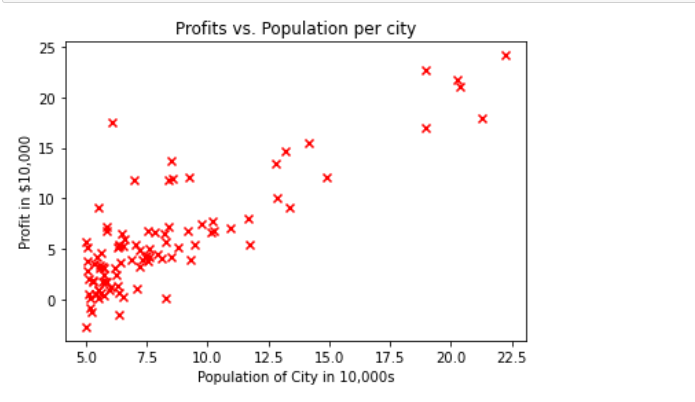
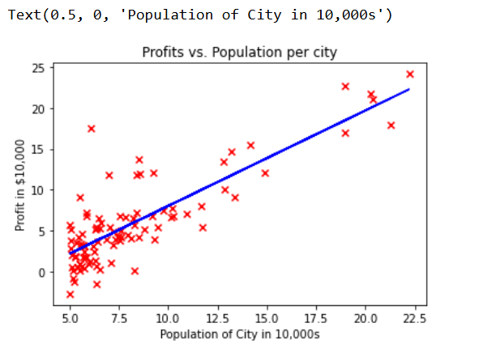
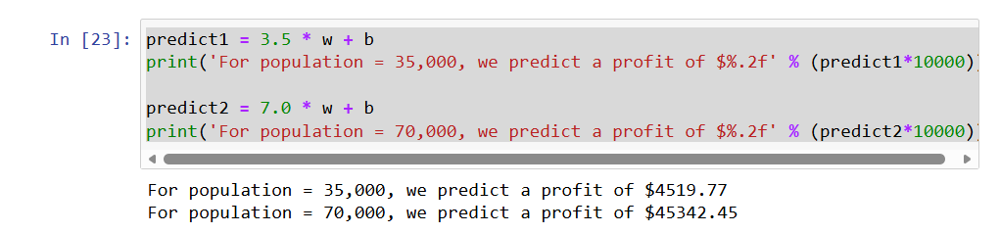

# restaurant-profit-prediction
# Linear Regression Practice Lab

This repository contains my implementation of **Linear Regression with Gradient Descent**, completed as part of the Coursera Machine Learning course (Week 2 Practice Lab).

---

## 🎓 Course Introduction

This lab is part of the **Supervised Machine Learning: Regression and Classification** course, offered by **DeepLearning.AI** in collaboration with **Stanford Online**.  
The course is taught by Andrew Ng (Top Instructor) and team, and is part of the **Machine Learning Specialization**.  

---

## 📌 Problem Statement

You are the CEO of a restaurant franchise and are considering different cities for opening a new outlet.  
To make informed decisions, you want to expand your business to cities that may generate higher profits.  

- You already have data from existing restaurants: **city populations** and their corresponding **profits**.  
- You also have data for candidate cities: **city populations only**.  
- The challenge is to use the existing data to build a predictive model that estimates profits based on population size.  

By applying **linear regression**, you can learn the relationship between population and profit, then use this model to predict which candidate cities are most likely to yield higher profits.

---

## ⚙️ Implementation

Key steps:
1. **Compute Cost**  
   Implemented `compute_cost()` to evaluate how well the model fits the data.

2. **Compute Gradient**  
   Implemented `compute_gradient()` to calculate the direction of parameter updates.

3. **Gradient Descent**  
   Used `gradient_descent()` to iteratively update parameters until convergence.

4. **Prediction**  
   Applied the trained model to predict profits for cities with populations of 35,000 and 70,000. 

---
## 📊 Results

### Scatter Plot of Training Data

### Linear Regression Fit

---

## 🔮 Predictions

- For population = **35,000**, predicted profit ≈ **$4,519.77**
- For population = **70,000**, predicted profit ≈ **$45,342.45**

---

## 🚀 Skills Demonstrated
- Python (NumPy, Matplotlib)
- Machine Learning fundamentals
- Gradient Descent optimization
- Data visualization

---

## 📈 Next Steps
- Extend to multivariate linear regression
- Explore regularization techniques
- Apply to real-world datasets
